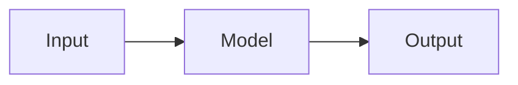

# Hugo Theme SciDraft

## A modern Hugo theme for scientific writing and research.

SciDraft is a Hugo theme designed for academic publications, research notes, technical explanations, and the sharing of evolving scientific thoughts.

It combines a clean, responsive academic presentation with features intended specifically for scientific and technical writing. The theme supports both short research notes and comprehensive scientific articles while keeping them within a unified content type.

**Demo:** [www.zhumengyao.com/scidraft](https://www.zhumengyao.com/scidraft/)

> SciDraft is based on [hugo-PaperMod](https://github.com/adityatelange/hugo-PaperMod/) with substantial extensions and customization.

------

## Installation

### Requirements

SciDraft currently requires **Hugo v0.158.0 or later**. The minimum Hugo version is specified in the theme metadata.

### Creating a Hugo Site with SciDraft

Follow these steps to create a new Hugo site and use SciDraft as its theme.

1. **Navigate to the directory where you want to create your Hugo site.**

2. **Create a new Hugo site:**

   ```bash
   hugo new site my-research-site
   ```

   This creates a new directory named `my-research-site` with the basic structure of a Hugo site.

3. **Enter the new site directory:**

   ```bash
   cd my-research-site
   ```

4. **Enter the `themes` directory:**

   ```bash
   cd themes
   ```

   The `themes` directory is used to store Hugo themes. If the `themes` directory was not created automatically by your Hugo installation, create it with:

   ```bash
   mkdir themes
   ```

   Then enter it with:

   ```bash
   cd themes
   ```

5. **Clone SciDraft into the `themes` directory:**

   ```bash
   git clone https://github.com/mengyaozhu/scidraft.git
   ```

   The resulting structure is approximately:

   ```text
   my-research-site/
   ├── content/                 # Your own content
   ├── assets/
   ├── layouts/
   ├── static/
   ├── hugo.toml
   └── themes/
       └── scidraft/            # Cloned SciDraft theme
           └── exampleSite/     # SciDraft demo site
   ```

6. **Add your own content.**

   Place your Markdown files in the `content` directory of your Hugo site:

   ```text
   my-research-site/content/
   ```

   **Your Hugo site's `content` directory is separate from the demo content provided in SciDraft's `exampleSite/` directory.**

7. **Preview the SciDraft demo site.**

   To preview the demo site included with SciDraft, run:

   ```bash
   cd scidraft/exampleSite && hugo server
   ```

   Hugo will display the local server address in the terminal. Open that address in a web browser to view the demo site.

   The demo content is provided for demonstration purposes. It is separate from your own content in `my-research-site/content/`.

------

## Why SciDraft?

Scientific writing often combines several kinds of information in a single document: prose, mathematical notation, citations, algorithms, diagrams, tables, references, and links between related results.

SciDraft is designed around this workflow. Instead of requiring separate systems for research notes, technical explanations, and publication-style material, it provides a common Markdown-based environment for presenting them as a coherent research collection.

The theme is particularly suited to:

- research notes and working notes
- academic and scientific articles
- technical explanations
- mathematical writing
- literature-based research
- AI-assisted research notes
- collections of related results or methods
- personal academic and research websites

------

## Key Features

### Scientific writing in Markdown

SciDraft uses Markdown as the primary authoring format. This keeps content portable, version-controllable, and easy to edit while allowing the theme to provide specialized presentation for scientific material.

A single content type supports both quick research notes and longer scientific articles.

### BibTeX citations

SciDraft provides support for **BibTeX-based citations**, allowing references to be maintained separately from the main text and reused across research notes and articles.

This makes the theme suitable for literature-oriented writing and publication-style references.

### Mathematical typesetting with KaTeX

Mathematical expressions can be written using standard LaTeX-style notation and rendered with **KaTeX**.

For example:

```markdown
The Gaussian density is

$$
p(x) = \frac{1}{\sqrt{2\pi\sigma^2}}
\exp\left(-\frac{(x-\mu)^2}{2\sigma^2}\right).
$$
```

This makes mathematical derivations and formulas a natural part of the writing workflow.

### Mermaid diagrams

SciDraft supports **Mermaid diagrams**, allowing diagrams to be described directly in Markdown rather than created as separate image files.

For example:

~~~markdown

~~~

This is useful for research workflows, conceptual diagrams, process descriptions, and other structured visualizations.

### Pseudo-algorithm blocks

Scientific and technical writing frequently requires algorithms to be communicated clearly without tying the explanation to a particular programming language.

SciDraft provides styling for pseudo-algorithm blocks so that algorithmic procedures can be presented as part of a research note.

### Per-table style variants

Tables can be presented using different table styles according to the type of information being communicated. This allows tables to function as part of the document's visual language rather than as generic Markdown tables.

### Entry maps and indexed research collections

SciDraft provides an **entry-map** mechanism for organizing related notes into searchable/indexed collections.

The demo includes A–Z and category-based indexes for different series of entries. These indexes can be configured through the site's `entrySets` settings.

This is useful when a site contains a growing collection of mathematical results, methods, concepts, definitions, or other recurring research entries.

### Search

SciDraft includes a search interface for navigating a growing collection of research notes and articles.

### Responsive and light/dark presentation

SciDraft provides a responsive layout suitable for different screen sizes and supports light and dark modes. Long mathematical expressions are automatically wrapped to fit narrow screen widths.

The theme also provides features such as a table of contents, breadcrumbs, reading time, related notes, RSS, social icons, Open Graph and social metadata, and light/dark mode toggling.

### Academic-oriented presentation

The theme is designed to accommodate the visual and structural requirements of research writing while retaining the simplicity of a modern Hugo website.

It supports features such as:

- table of contents
- breadcrumbs
- reading time
- word count
- related notes
- post navigation
- sharing buttons
- comments
- RSS
- multiple authors
- canonical links
- responsive presentation
- light/dark theme switching

These capabilities are reflected in the theme's metadata and configuration.

------

## Styling and Design

SciDraft follows a clean, single-column presentation designed to keep attention on the content.

The design emphasizes:

- readable scientific prose
- clear mathematical notation
- structured headings
- visually distinct code and algorithm blocks
- readable tables
- diagrams integrated into the document
- navigation through related research content
- responsive display on different devices
- light and dark viewing modes

The result is intended to resemble a research notebook combined with a publication-oriented personal website rather than a conventional blog.

------

## Using Your Own Content

Once SciDraft has been added to your Hugo site, your own Markdown files should be stored in the site's `content/` directory.

For example:

```text
content/
├── notes/
│   ├── mathematics/
│   │   ├── probability.md
│   │   └── optimization.md
│   ├── biology/
│   │   └── genetics.md
│   └── physics/
│       └── quantum-mechanics.md
└── about.md
```

Notes can be organized into subdirectories within `content/`. These subdirectories can be used to group related notes without requiring different content types.

The `exampleSite` inside the SciDraft theme is a demonstration site and should not be confused with the content directory of your own website.

------

## Configuration

The main configuration file for your Hugo site is `hugo.toml`, located in the root directory of your site.

```text
my-research-site/
├── content/
├── hugo.toml        # Your site's main configuration
└── themes/
    └── scidraft/
```

The included demo configuration provides examples of important settings.

Users can adapt these settings to their own website rather than copying the demo configuration unchanged.

------

## Scientific Content

A SciDraft article can combine ordinary Markdown with scientific notation and specialized content.

For example:

~~~markdown
# A Research Note

This is a short explanation of a mathematical result.

## Mathematical formulation

$$
f(x) = \sum_{i=1}^{n} w_i x_i
$$

## Algorithm

```text
Input: x
Compute f(x)
Return f(x)
```

## Diagram


~~~

The exact front matter and specialized blocks available to a page should be adapted from the examples included in `exampleSite`.

------

## Demo Site

SciDraft includes a self-contained `exampleSite` that demonstrates the theme's functionality.

The online demonstration is available at:

[**https://www.zhumengyao.com/scidraft/**](https://www.zhumengyao.com/scidraft/)

The demo contains examples of the theme's scientific-writing features and can be used as a reference when creating new content.

------

## Repository Structure

The main repository contains the theme itself and an example site:

```text
scidraft/
├── assets/                  # Theme assets
├── docs/                    # Documentation
├── exampleSite/             # Self-contained demonstration site
│   ├── assets/
│   ├── content/
│   ├── static/
│   └── hugo.toml
├── i18n/                    # Internationalization resources
├── layouts/                 # Hugo templates and theme layouts
├── go.mod
├── hugo.toml
├── theme.toml
├── LICENSE
└── README.md
```

The repository currently identifies `assets`, `docs`, `exampleSite`, `i18n`, and `layouts` as its main directories.

------

## Theme and Site: An Important Distinction

SciDraft is a **theme**, while your Hugo website is a separate project.

A recommended structure is:

```text
my-research-site/
├── content/                 # Your research content
├── assets/                  # Your site assets
├── static/                  # Your static files
├── hugo.toml                # Your site configuration
└── themes/
    └── scidraft/            # SciDraft theme
```

Your own articles belong in:

```text
my-research-site/content/
```

The SciDraft demonstration content belongs in:

```text
my-research-site/themes/scidraft/exampleSite/
```

The demonstration content is intended to show how the theme works; it does not need to be used as the content of your own site.

------

## Local Development

From the root directory of your own Hugo site, start the development server with:

```bash
hugo server
```

Hugo provides a local web server and automatically rebuilds the site when source files are changed during development.

After editing a Markdown file, save it and refresh the browser to inspect the result.

To stop the development server, press:

```text
Ctrl + C
```

------

## Updating SciDraft

If SciDraft was cloned directly into your site's `themes/scidraft` directory, you can update the theme with:

```bash
cd themes/scidraft
git pull
```

Review the changes before using a newer version in a production site, particularly if you have customized your site's configuration or overridden theme templates.

------

## Customization

Hugo allows a site to override theme templates without modifying the theme itself.

This makes it possible to keep SciDraft as a separate theme while customizing the appearance or behavior of your own website.

For long-term maintainability, prefer placing site-specific configuration, content, assets, and template overrides in your own Hugo site rather than modifying files directly inside `themes/scidraft`.

------

## License

SciDraft is released under the **MIT License**. See [`LICENSE`](https://github.com/mengyaozhu/scidraft/blob/main/LICENSE) for the full license text. The theme metadata identifies the project as MIT-licensed.

------

## Acknowledgements

SciDraft is based on [PaperMod](https://github.com/adityatelange/hugo-PaperMod/) and extends and customizes it for scientific writing and research-oriented publishing.

------

## Links

- **SciDraft repository:** https://github.com/mengyaozhu/scidraft
- **SciDraft demo:** https://www.zhumengyao.com/scidraft/
- **Hugo:** https://gohugo.io/
- **PaperMod:** https://github.com/adityatelange/hugo-PaperMod/


