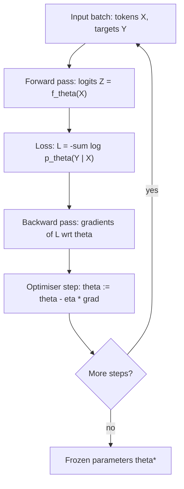

+++
title = "A Transformer Training Step (flowchart)"
date = 2026-09-21T14:02:00+09:00
tags = ["Demo", "Mermaid", "LLM", "Neural Networks"]
renderingTitle = "Mermaid: Flowchart"
renderingCategory = "Mermaid"
renderingAliases = ["Flowchart", "Flow Diagram", "Process Diagram"]
renderingSummary = "Traces a transformer training step as a directed flowchart, showing the order of forward pass, loss and update."
math = true
showTitle = true
+++

**Demo note.** This note demonstrates what the **SciDraft** Hugo theme can do
for academic and scientific publishing — for research institutions, researchers
and students. Its content is demonstration material only: readers should ignore
whether the demo content is correct.

One training step is a fixed cycle: the model predicts, the predictions are
scored against the targets, the error is propagated backwards, and the
parameters move a little in the direction that reduces it. The diagram below
shows that cycle; the repetition is the whole of training.

In notation, the step computes a loss \(L(\theta)\) over a batch, obtains the
gradient \(\nabla_\theta L\) by backpropagation, and applies an update
\(\theta \leftarrow \theta - \eta \nabla_\theta L\), where \(\eta\) is the
learning rate. Adaptive optimisers such as Adam rescale that update per
parameter, but the loop structure is unchanged.

**Reading the diagram.** Step 1–2 is the forward pass: the same computation
used at inference time, with the loss attached at the end. Steps 3–4 are the
part that exists only during training — backpropagation applies the chain rule
layer by layer to obtain one gradient per parameter. The branch at the bottom is
where practice departs from theory: the batch is a sample, so each step moves
the parameters along a noisy estimate of the true gradient, and the learning
rate schedule decides how large those moves may be.
