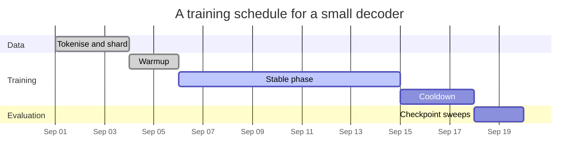

+++
title = "A Training Schedule (gantt)"
date = 2026-09-21T16:00:00+09:00
tags = ["Demo", "Mermaid", "Optimization"]
math = true
showTitle = true
+++

**Demo note.** This note demonstrates what the **SciDraft** Hugo theme can do
for academic and scientific publishing — for research institutions, researchers
and students. Its content is demonstration material only: readers should ignore
whether the demo content is correct.

A training run has a shape in time as well as in the loss curve: data preparation
that nothing else can start without, a warmup whose length is set by the step
size, a long stable phase, and a cooldown whose purpose is to end at a point the
optimiser has settled into.

This note uses a Gantt chart, which is the diagram type for anything where the
order and duration of phases is the content. The bars below are illustrative
rather than measured, and the durations are the ones a small decoder run would
typically use.

The dependency arrows matter more than the bar lengths: the schedule encodes the
constraint that evaluation cannot begin before a checkpoint exists, and the
warmup cannot be skipped because the step size at initialisation is larger
relative to the curvature than it is later in the run.
