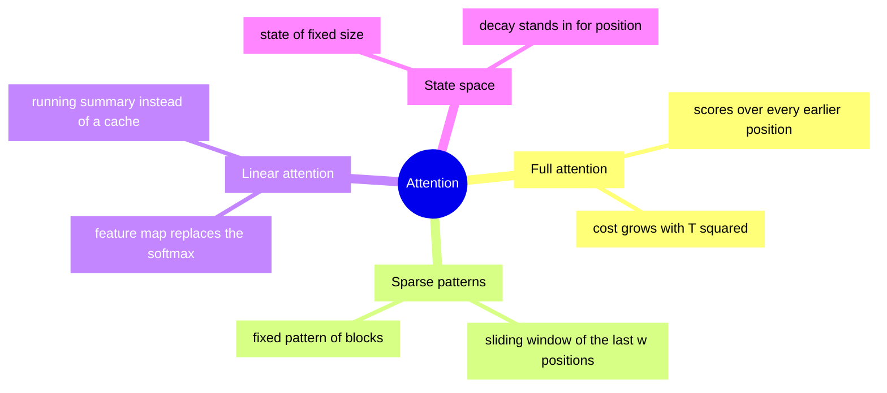

+++
title = "Families of Attention (mindmap)"
date = 2026-09-21T09:44:00+09:00
tags = ["Demo", "Mermaid", "Attention"]
renderingTitle = "Mermaid: Mindmap of Attention"
renderingCategory = "Mermaid"
renderingAliases = ["Mindmap", "Concept Map", "Radial Diagram"]
renderingSummary = "Presents the components of attention as a mindmap, grouping queries, keys, values and their relationships around a centre."
math = true
showTitle = true
+++

**Demo note.** This note demonstrates what the **SciDraft** Hugo theme can do
for academic and scientific publishing — for research institutions, researchers
and students. Its content is demonstration material only: readers should ignore
whether the demo content is correct.

The variants of attention that appear in long-context work are easier to keep
apart by what they replace than by their names: each one gives up the full score
matrix and puts something else in its place, and the something else is what the
family is called.

This note uses a mind map, which suits a taxonomy with no order to it: the four
families below are siblings, and the leaves under each are the mechanism rather
than a sequence of steps.

Read this way, the families differ in what they keep: a sparse pattern keeps the
softmax and drops most of its entries, a linear method keeps all the entries and
drops the softmax, and a state-space model drops the pairwise structure
altogether in favour of a recurrence.
