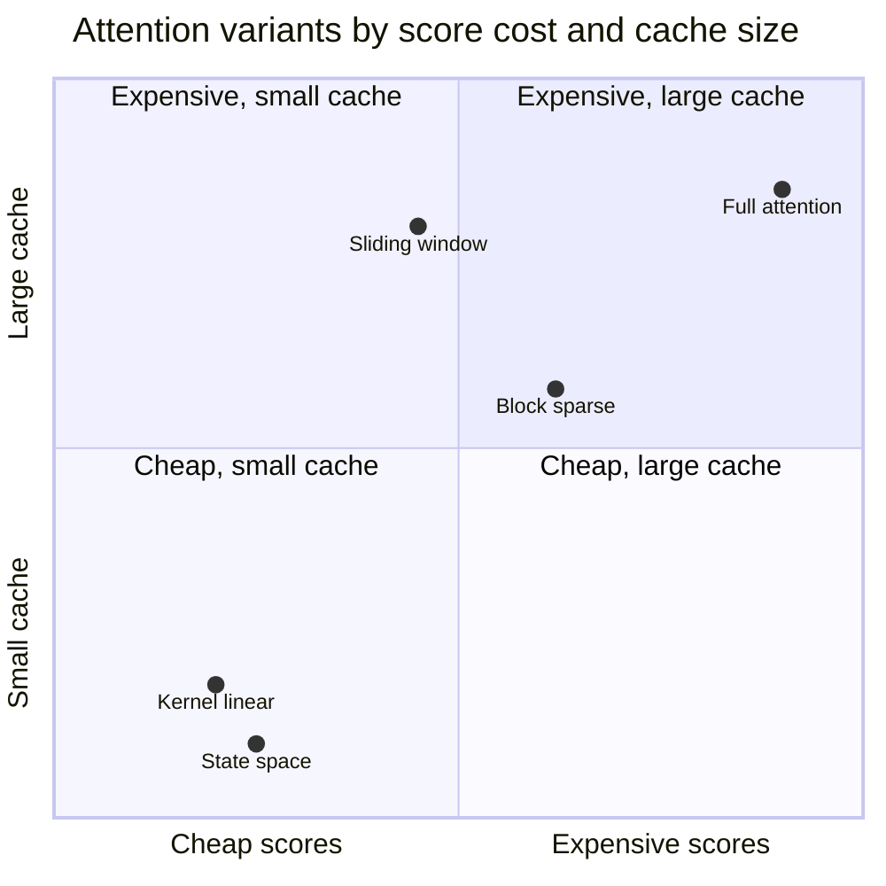

+++
title = "Attention Variants by Cost and Cache (quadrant chart)"
date = 2026-09-21T14:21:00+09:00
tags = ["Demo", "Mermaid", "Attention"]
renderingTitle = "Mermaid: Quadrant Chart"
renderingCategory = "Mermaid"
renderingAliases = ["Quadrant Chart", "Two-Axis Scatter", "Priority Matrix"]
renderingSummary = "Plots attention variants on two axes so their cost and cache requirements can be compared at a glance."
math = true
showTitle = true
+++

**Demo note.** This note demonstrates what the **SciDraft** Hugo theme can do
for academic and scientific publishing — for research institutions, researchers
and students. Its content is demonstration material only: readers should ignore
whether the demo content is correct.

Choosing an attention variant is a two-constraint problem rather than a ranking:
the score cost decides how long a sequence can be trained on, and the per-token
cache decides how long a sequence can be served, and the two orderings of the
variants are not the same.

This note uses a quadrant chart, which is the right shape for two independent
axes with no third quantity to show. Positions are qualitative — ranked rather
than measured — and the axes run from cheap to expensive on both counts.

The chart makes the usual trade-off visible in one picture: every variant that
reduces the score cost by sparsifying still pays the full cache, so it lands in
the right-hand column, while the variants that replace the pairwise structure
move to the bottom left and pay instead in expressiveness.
