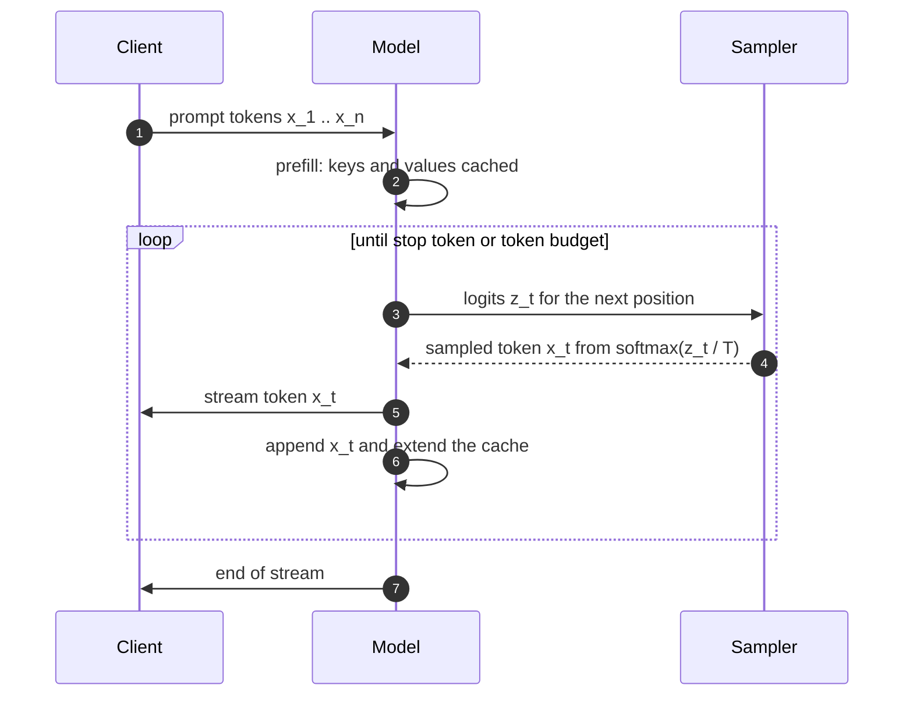

+++
title = "Autoregressive Generation (sequence diagram)"
date = 2026-09-21T10:42:00+09:00
tags = ["Demo", "Mermaid", "LLM", "Inference"]
renderingTitle = "Mermaid: Sequence Diagram"
renderingCategory = "Mermaid"
renderingAliases = ["Sequence Diagram", "Message Sequence Chart", "Interaction Diagram"]
renderingSummary = "Orders the calls in an inference request as a sequence diagram, from client through the model to the token stream back."
math = true
showTitle = true
+++

**Demo note.** This note demonstrates what the **SciDraft** Hugo theme can do
for academic and scientific publishing — for research institutions, researchers
and students. Its content is demonstration material only: readers should ignore
whether the demo content is correct.

A language model writes one token at a time. The prompt is processed once, then
each new token is appended to the sequence and fed back in, so generation is a
loop between the model and the sampler rather than a single call. The sequence
diagram below shows the participants and the messages between them.

The loop samples from a distribution over the vocabulary, conditioned on
everything generated so far: \(x_t \sim p(\cdot \mid x_{\lt t})\). The logits are
usually divided by a temperature \(T\) before the softmax, and truncation
(keeping only the most probable tokens) changes the support of that
distribution rather than the model itself.

**Reading the diagram.** The prefill call is the only one that processes the
whole prompt; every later step processes one position and reuses the cached
keys and values, which is why the first token arrives slowly and the rest
quickly. The sampler is drawn as a separate participant because it is where
generation is controlled — temperature and truncation act there, not in the
model. The loop's exit condition matters just as much: a stop token ends it
early, while a token budget ends it by force, and the two produce different
kinds of output.
