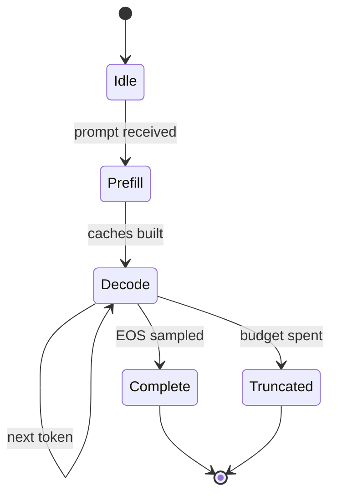

+++
title = "Decoding as a State Machine (state diagram)"
date = 2026-09-21T10:12:00+09:00
tags = ["Demo", "Mermaid", "LLM", "Inference"]
renderingTitle = "Mermaid: State Diagram"
renderingCategory = "Mermaid"
renderingAliases = ["State Diagram", "State Machine", "Transition Diagram"]
renderingSummary = "Shows a decoding loop as a state diagram, with the transitions between prompt, generation and stop states."
math = true
showTitle = true
+++

**Demo note.** This note demonstrates what the **SciDraft** Hugo theme can do
for academic and scientific publishing — for research institutions, researchers
and students. Its content is demonstration material only: readers should ignore
whether the demo content is correct.

The same generation loop can be described without messages, as a machine with
a small number of states. This view is useful when the interesting questions are
about *transitions* — when decoding starts, what keeps it running, and which
conditions end it. The state diagram below is the whole lifecycle of one
completion.

Two conditions drive the transitions. The first is the probability the model
assigns to the end-of-sequence token: decoding stops when it becomes the sampled
token, \(x_t = \langle \text{eos} \rangle\). The second is a hard budget — a
maximum number of tokens — which stops generation that has not converged, and is
the reason a truncated answer can look unfinished.

**Reading the diagram.** `Prefill` and `Decode` are separate states because they
cost differently: prefill processes the prompt in parallel, decode advances one
position at a time and is bound by memory traffic rather than arithmetic. The
self-loop on `Decode` is where almost all the time is spent. Note also that the
two exit states are not equivalent — `Complete` means the model chose to stop,
`Truncated` means something else did, and downstream code that treats them as the
same will occasionally present a cut-off answer as a finished one.
