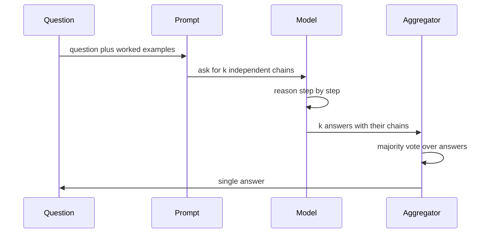

+++
title = "A Survey of Chain-of-Thought Prompting: Single Chains, Sampling and Demonstration Construction (survey)"
date = 2026-09-21T15:29:00+09:00
tags = ["Demo", "Survey", "Prompting"]
renderingTitle = "Survey: Chain of Thought"
renderingCategory = "Citations"
renderingAliases = ["Chain-of-Thought Survey", "Reasoning Survey", "CoT Literature Review"]
renderingSummary = "Surveys chain-of-thought prompting, combining prose, a pseudo-algorithm, a sequence diagram and a bibliography."
math = true
showTitle = true
+++

**Demo note.** This note demonstrates what the **SciDraft** Hugo theme can do
for academic and scientific publishing — for research institutions, researchers
and students. Its content is demonstration material only: readers should ignore
whether the demo content is correct.

Chain-of-thought prompting began as a single sentence appended to a prompt and is
now a family of strategies that differ in what they add: a fixed reasoning
skeleton, several sampled chains and a vote, demonstrations the method writes for
itself, or calls to an external tool in the middle of the reasoning. This survey
groups the entries in its bibliography by that question, following the framing of
the earlier survey of prompting strategies \cite{Yu2023-qr}, and asks in each
group what the reported gain is actually attributed to.

**Table 1.** The families differ in what they add to the prompt and in what the
reported improvement is attributed to.

| Family | What is added | Reported effect | Representative work |
| :--- | :--- | :--- | :--- |
| Single chain | an instruction to reason step by step | large gains on multi-step tasks | \cite{Wang2022-hh}, \cite{Cheng2025-sl} |
| Structured chain | a fixed order of sub-tasks | fewer unsupported statements | \cite{Sultan2024-rc}, \cite{Cheng2024-az} |
| Sampling and voting | several chains, then an aggregation rule | accuracy rises with the sample count | self-consistency \cite{Wang2022-ir}, uncertainty-guided \cite{Kumar2024-bj} |
| Demonstration construction | chains written or selected by the method | removes hand-written examples | \cite{Shao2023-lx}, \cite{Diao2024-at}, \cite{Ye2023-wa} |
| Contrastive and corrective | wrong chains as negative examples | fewer shortcut answers | \cite{Chia2023-cz}, \cite{Tian2023-bk} |
| Tool-augmented | calls to an external tool inside the chain | grounding on computation | \cite{Inaba2023-cg} |

The diagram below shows where the families differ in time: the first four change
what is put into the prompt, while sampling and voting and the tool-augmented
family change what happens after the model has answered.



**Proposed theory: reliability of a chain and the gain from voting.** Model a
chain of \(L\) steps as correct only if every step is, with per-step reliability
\(p\) and independence between steps, and write \(q\) for the probability that
a single sampled chain yields the correct final answer. The theory this survey
proposes for testing is the pair of statements below: the reliability of one
chain, and what voting over several of them does to it.

$$
\Pr(\text{chain is correct}) = p^{L} ,
$$

$$
\Pr(\text{majority vote is correct}) \to 1 \quad \text{as} \ k \to \infty
\qquad \text{whenever} \quad q \gt \tfrac{1}{2} .
$$

The second statement is where the method's limit lives: sampling changes neither
\(p\) nor \(L\), so at \(q \leq \tfrac{1}{2}\) more samples do not help, and
a task on which chains are individually unreliable needs a change to the prompt
rather than a larger sample.

**Algorithm 1** writes the sampling rule that the voting family shares, and makes
the two quantities above concrete: \\(k\\) independent draws and one aggregation
step.

```pseudo-algorithm
\begin{algorithm}[H]
\footnotesize
\caption{Self-consistency decoding}
\begin{algorithmic}[1]
\Require question \(x\), prompt \(P\), sample count \(k\), temperature \(T\)
\State draw \(k\) chains independently from \(p_\theta(\cdot \mid P, x)\) at temperature \(T\)
\For{each sampled chain}
    \State extract the final answer \Comment{string match, or a task-specific parser}
\EndFor
\State return the most frequent answer, with its share of the vote
\end{algorithmic}
\end{algorithm}
```

**Listing 1** is the aggregation step on its own, which is where the method is
usually implemented badly: the vote is over extracted answers, not over chains,
so an answer that appears in fluent prose has to be parsed before it can be
counted. Run as printed it reports `answer B with 57% of the vote`.

```python
from collections import Counter


def self_consistency(answers):
    """Majority vote over the answers extracted from sampled chains."""
    counts = Counter(answers)
    best, votes = counts.most_common(1)[0]
    return best, votes / len(answers)


if __name__ == "__main__":
    answers = ["B", "C", "B", "B", "D", "C", "B"]
    answer, share = self_consistency(answers)
    print(f"answer {answer} with {share:.0%} of the vote")
```

What the surveyed work leaves open is the same in both directions: whether a
chain improves an answer or merely accompanies it, which the studies of
hallucination cues \cite{Cheng2025-wj} and of what matters in a chain
\cite{Wang2022-hh} both probe, and how a demonstrated gain should be reported
when the same prompt is reused across tasks — the question the earlier survey
raises and which the later comparisons of zero-shot and few-shot settings
\cite{Cheng2025-sl} make sharper.


