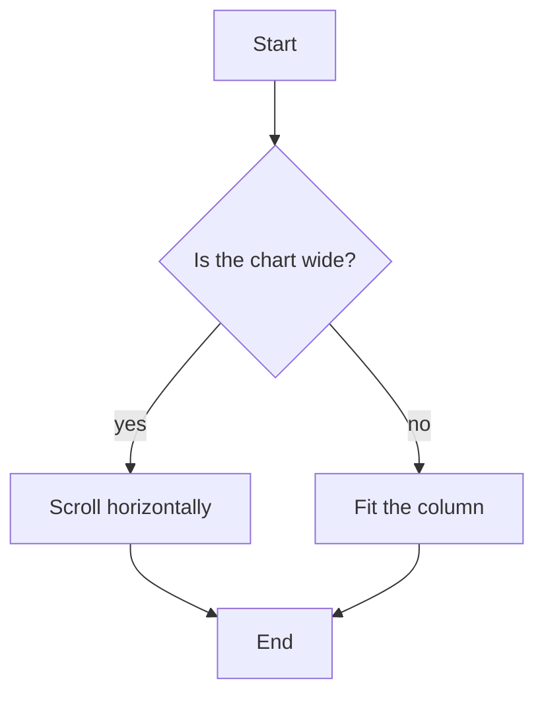

+++
title = "Note with Mermaid"
date = 2026-09-21T07:52:00+09:00
tags = ["DyCo Skills", "Learning with Agentic AI"]
renderingTitle = "Mermaid: Overview"
renderingCategory = "Mermaid"
renderingAliases = ["Mermaid Overview", "Diagram Gallery", "Mermaid Reference"]
renderingSummary = "Collects the Mermaid diagram types the theme renders, each as a short working example."
+++
DyCo Skills in one line: humans choose and oversee, agents draft and scale, the workflow is dynamic.

