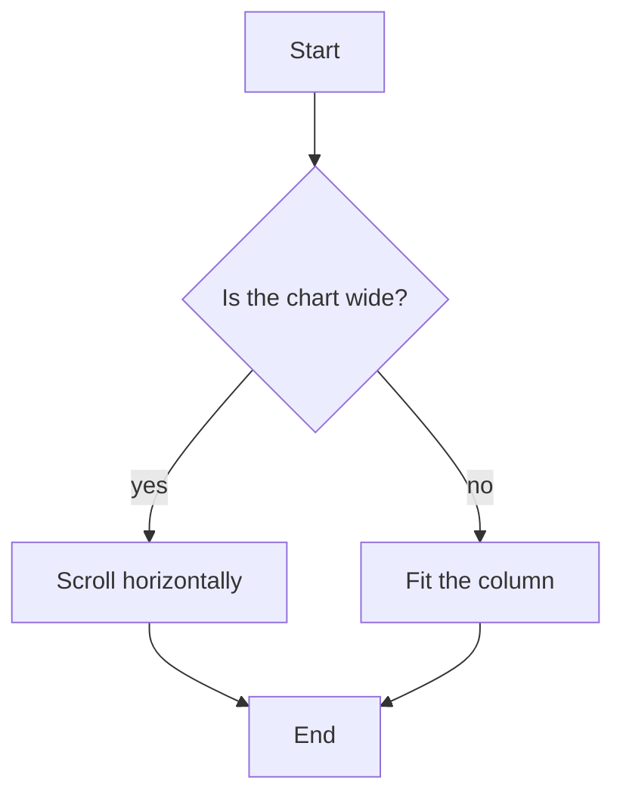
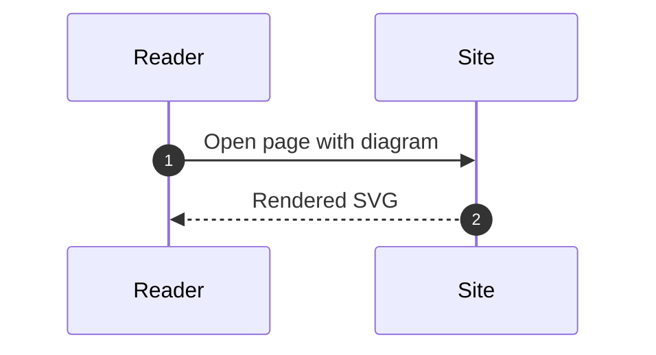

+++
title = "Note with References"
date = 2026-09-21T08:42:00+09:00
occupationTitle = "Business Intelligence Analyst"
occupationCategory = "Data & AI"
alternativeTitles = ["BI Analyst", "Business Intelligence Specialist", "Business Intelligence Consultant", "Market Intelligence Analyst"]
shortDescription = "Collects, analyzes, organizes, and communicates business, financial, market, customer, and operational information to identify patterns and trends, support decision-making, and improve business performance."
math = true
tags = ["AI and Jobs", "Human Skills", "Agentic Skills", "Working with Agentic AI", "Business Intelligence Analyst"]
showTitle = false 
+++

# 1. Working with Agentic AI: Business Intelligence Analyst

*How human skills and agentic skills are dynamically integrated and coordinated across business intelligence responsibilities*

## 1.1. Business Intelligence Analyst as an Occupation



A **business intelligence analyst** collects, organizes, analyzes, interprets, and communicates business information to support organizational decision-making. This occupation connects data analysis with strategic objectives by transforming financial, market, customer, operational, and competitive data into actionable intelligence. To ensure this information drives effective decisions, the analyst must understand how business questions, data sources, analytical methods, performance measures, and stakeholder requirements collectively determine its meaning and usefulness.

Typical responsibilities of a business intelligence analyst include:

*   business intelligence data collection and integration;
*   business data analysis and pattern identification;
*   business reporting and information communication;
*   dashboard and business intelligence solution development;
*   business intelligence systems, databases, and information management;
*   market, customer, competitive, and industry intelligence analysis;
*   business intelligence quality assurance and technical support; and
*   business insight synthesis and decision support.



These responsibilities are fulfilled through distinct tasks and subtasks, each requiring one or more actions with specific skill requirements. Human skills and agentic skills both contribute to these responsibilities, but their levels and forms of involvement differ according to the responsibility, task, action, data, business context, technical environment, and expected outcome.




## Reference Example 

**PEARL (Planning with Executable Actions for Reasoning over Long Documents)** \cite{Sun2023-bm} is a multi-stage prompt framework specifically designed to improve how large language models reason over lengthy texts. The process begins with an action mining stage, where the model is prompted, using a few manually crafted seed actions as examples, to generate a broader set of task-specific, reusable actions from training questions. Each action is formatted like a program function with a natural language definition. Next, in the plan generation stage, the model is given a new question and, through few-shot prompt with demonstrations of good plans, formulates a sequence of these mined actions. This plan acts as a blueprint, where the output of one action can be used as an input for another. Finally, in the plan execution stage, the model executes the plan step-by-step. For each step, it is given a zero-shot prompt containing the long document, the specific action to perform, and the results from previous steps, allowing it to generate a detailed output. To ensure the quality of the few-shot demonstrations used in plan generation, the framework incorporates a self-refinement mechanism where the model corrects its own plans based on error messages or execution results before they are used as examples. The principal evidence for PEARL's effectiveness comes from experiments on a challenging subset of the QuALITY \cite{Pang2022-xi} dataset. On questions requiring long-context understanding, PEARL achieved an accuracy of \(70.9\%\), significantly outperforming the zero-shot GPT-4 \cite{OpenAI2023-mb} baseline which scored \(64.3\%\). For the most complex questions that required the full document, PEARL's performance was even stronger at \(72.4\%\) compared to the baseline's \(61.9\%\), demonstrating that its structured, multi-stage approach leads to more accurate answers.


## 1.2. Human Skills and Agentic Skills in Business Intelligence Analysis

Business intelligence analysis increasingly integrates both **human skills** and **agentic skills**.

Human skills are reusable capabilities possessed and developed by business intelligence analysts. They include business understanding, analytical reasoning, statistical reasoning, data interpretation, information design, stakeholder communication, requirement analysis, problem formulation, critical thinking, contextual interpretation, and professional judgment.

Agentic skills are reusable capabilities available to AI agents through their underlying models, contextual information, instructions, constraints, tools, and computational resources. In business intelligence analysis, these skills include information retrieval, data extraction, data profiling, classification, summarization, calculation, query generation, report generation, visualization support, trend detection, comparison, anomaly identification, documentation support, and tool use.

Both skill types contribute to the same occupational responsibilities, but their involvement varies by action. Understanding a loosely defined business question relies primarily on human knowledge of organizational objectives and stakeholder needs; an AI agent then uses agentic skills to retrieve and organize relevant information that supports the analyst’s interpretation. In data analysis, the analyst first determines appropriate analytical questions, and an AI agent subsequently queries data, calculates measures, and identifies patterns. For reporting, an AI agent generates and summarizes content, while the analyst interprets the output to ensure it conveys accurate and meaningful business insight. Across these actions, human and agentic skills are activated sequentially or iteratively based on task requirements, with the human professional maintaining oversight and final judgment.

The relationship between these skills is not a fixed division where certain responsibilities permanently belong to humans and others to AI. Instead, human and agentic involvement shifts across tasks and between different actions within the same task.



## 1.3. Dynamic Human–Agentic Skill Integration and Collaboration in Business Intelligence Analysis

Business intelligence analysis functions as an occupation where responsibilities are fulfilled through tasks and subtasks, tasks and subtasks are executed through actions, and actions require appropriate configurations of human and agentic skills.

An **occupation** provides the overall professional context. For business intelligence analysis, this context encompasses collecting and analyzing business information, developing and maintaining business intelligence solutions, communicating analytical findings, and supporting organizational decisions.

A **responsibility** represents an expected area of professional work or an outcome that the business intelligence analyst accomplishes or maintains. Responsibilities such as data analysis, business reporting, market intelligence, and decision support each contain multiple tasks.

A **task** is a **context-dependent unit of work** used to fulfill part or all of a responsibility. When a task is too broad or complex for reliable execution, it is decomposed into smaller **subtasks**.

```text
                         Responsibility
                               │
                               ▼
                             Task
                               │
                  Is the task sufficiently
                    specific and executable?
                         /           \
                       Yes            No
                        │              │
                        │              ▼
                        │        Decompose into
                        │           subtasks
                        │          /    |    \
                        │         ▼     ▼     ▼
                        │       ST 1   ST 2   ST 3
                        │               │
                        │         If still too broad
                        │               │
                        │               ▼
                        │          Decompose again
                        │           /         \
                        │          ▼           ▼
                        │       ST 2.1      ST 2.2
                        │
                        ▼
                     Actions
```

Tasks and subtasks are executed through one or more **actions**. Actions represent **reusable and configurable operations** such as retrieving information, querying a data repository, calculating a performance measure, comparing business segments, detecting a trend, generating a visualization, validating a report, or summarizing analytical findings.

Each action has **skill requirements**. These requirements describe the capabilities needed for effective and reliable execution. Depending on the action and its context, human skills, agentic skills, or an integration of both can satisfy these requirements.

The skills available for business intelligence analysis reside in a **skill space** containing both human skills and agentic skills. Relevant skills in this space can serve as candidate skills for executing the actions required by a particular task. A human skill in business interpretation, for example, can serve as a candidate for determining the significance of a performance change, while an agentic skill in data comparison can serve as a candidate for related analytical actions.

Candidate skills are evaluated relative to the requirements of the action and its occupational and task context. Appropriate skills are then selected and organized into a **skill configuration** for execution. Depending on these requirements, a configuration may rely mainly on human skills, mainly on agentic skills, or on an integrated arrangement of both.

### 1.3.1. Skills Competition and Skills Collaboration

Two important relationships can occur between human skills and agentic skills when constructing a skill configuration: **skills competition** and **skills collaboration**.

**Skills competition** occurs when both a human skill and an agentic skill can satisfy the same or similar requirements for an action, but simultaneous application of both is unnecessary. Under a particular occupational and task context, one skill type can provide a better fit for the action than the other.

For example, both a business intelligence analyst and an AI agent can generate a standard summary of monthly sales performance. When measures, reporting structures, and business definitions are clearly specified, the agentic skill provides fast and scalable execution. When the report requires interpretation of unusual organizational circumstances, changing business definitions, or ambiguous stakeholder requirements, the analyst's human skills provide the necessary contextual understanding.

The purpose of skills competition is not to establish whether human or agentic skills are generally superior. Rather, it identifies which available skill provides the better fit for a particular action under particular conditions.

**Skills collaboration** occurs when one skill type alone cannot effectively satisfy the requirements of a task or its actions, or when combining complementary human and agentic skills produces stronger task performance.

Collaboration does not require human and agentic skills to operate simultaneously. Instead, they are activated at different stages of action execution in a **sequential, iterative, or recursive manner** according to evolving task requirements.

For example, an analyst first identifies an unexpected decline in customer retention and determines which aspects of the change require investigation. An AI agent then retrieves and compares relevant customer and operational data and identifies initial patterns associated with the decline. The analyst subsequently interprets these patterns within their business context and formulates possible explanations. Based on the analyst's direction, the agent next performs additional segment analysis to examine those explanations. Finally, the analyst evaluates the resulting evidence and determines which findings are sufficiently supported and relevant to communicate to decision-makers. Throughout this sequence, human and agentic skills are activated iteratively as task requirements evolve, while the analyst directs the investigation and evaluates its outcomes.

This dynamic relationship allows business intelligence analysts to leverage the complementary strengths of both skill types rather than relying on a permanent allocation of work.

### 1.3.2. Skill Configuration and Task Execution

A skill configuration specifies which human skills and agentic skills execute the actions associated with a task or subtask and how those skills coordinate.

The configuration depends on factors such as action requirements, data availability, data quality, business ambiguity, analytical complexity, expected reliability, available tools, information sensitivity, decision consequences, stakeholder expectations, and intermediate results.

For one action, an agentic skill may independently satisfy the requirements. For another, a human skill may provide the better fit. A complex task may require several configurations across multiple actions, with human and agentic skills repeatedly interacting as the task progresses.

The configuration is therefore dynamic rather than permanent. It may change when the action changes, new information becomes available, an agentic result fails to satisfy expected requirements, or human interpretation identifies a new direction for the analysis.

Throughout this process, the business intelligence analyst remains the professional responsible for promoting and controlling the work associated with the occupation and its responsibilities. Agentic AI provides powerful complementary capabilities that expand what the professional can retrieve, query, calculate, compare, analyze, visualize, summarize, and communicate.


As a second citing location for testing, PEARL remains the reference example for multi-stage planning over long documents \cite{Sun2023-bm}.


### 1.3.3. Task Performance Evaluation and Skill Space Adaptation

The performance produced through a selected skill configuration is evaluated against **predefined evaluation metrics**. These metrics determine whether the human skills, agentic skills, or their integrated configuration are sufficiently capable of performing the relevant task and its required actions.

Evaluation criteria depend on the work being performed. In business intelligence analysis, they include analytical accuracy, data consistency, calculation correctness, information completeness, reporting timeliness, reproducibility, interpretability, relevance to business requirements, technical reliability, and other task-specific expectations.

When a selected skill or skill configuration produces performance above the defined threshold, it passes the performance evaluation and is retained for future applications under appropriate conditions. Repeated successful use provides additional evidence about where that skill or configuration performs effectively.

When performance falls below the required threshold, the corresponding skill or configuration is not reused without modification. The relevant human or agentic skills may be refined or reconfigured, existing skills can be combined differently, or new human and agentic skills may be developed or constructed from scratch when the existing skill space lacks adequate capability.

For example, an AI agent first generates business reports with correct calculations but repeatedly produces inconsistent interpretations of organizational performance measures. Task performance evaluation identifies this interpretation problem as falling below the required threshold. The agentic skill is then refined through clearer metric definitions, stronger contextual instructions, validation procedures, or access to approved business metadata. The revised skill is evaluated again, and once it satisfies the required performance criteria, it is retained for appropriate future reporting tasks. Human skills follow a corresponding development process: when an analyst lacks the knowledge required to interpret a newly introduced business process, the relevant capability is developed through learning, collaboration, and practical experience before its performance is evaluated through subsequent work.

Refined and newly constructed skills that satisfy the required performance criteria are added to the skill space. In this way, task performance evaluation provides feedback not only for completing current work but also for continuously optimizing and expanding the available skill space.

The skill space is not constructed as an isolated collection of occupation-specific representations. Many human and agentic skills used in business intelligence analysis are reusable across occupations. Information retrieval, data analysis, statistical reasoning, calculation, summarization, visualization, communication, technical comparison, documentation, and tool use contribute to work in financial analysis, operations management, marketing, consulting, data science, research, and many other fields.

Reusable skills can therefore be represented once and configured differently according to the responsibilities, tasks, actions, and contexts of different occupations. This allows the skill space to serve a growing range of occupations without unnecessarily duplicating or exploding the number of skill representations. Occupational specialization is introduced through task context, action requirements, parameters, data sources, tools, constraints, and skill configurations rather than by creating a completely separate skill representation whenever the same underlying capability appears in another occupation.

The resulting process is adaptive:

**occupational responsibility → task and subtask → actions → skill requirements → candidate human and agentic skills → skill configuration → task execution → task performance evaluation → skill refinement, reconfiguration, or construction → optimized and expanded skill space**

This cycle allows human and agentic capabilities to evolve alongside the requirements of business intelligence work.

## 1.4. Essential Responsibilities of Business Intelligence Analyst

### 1.4.1. Business Intelligence Data Collection and Integration

Business intelligence data collection and integration establishes the information foundation required for analysis and reporting. This responsibility includes identifying relevant internal and external information sources, retrieving business data, combining information from different systems, examining data availability, and preparing information for subsequent analytical use.

Agentic skills contribute extensively to information retrieval, extraction, classification, data profiling, source comparison, and repeated data-processing actions. Human skills remain essential for determining which information is relevant, understanding the meaning and limitations of different sources, resolving ambiguous business definitions, and deciding whether the resulting data appropriately represents the intended business question.

For example, an analyst first defines an investigation into changing customer purchasing behavior and determines which customer, transaction, product, and channel information is relevant. An AI agent then retrieves available information from authorized sources, profiles the datasets, identifies inconsistencies, and proposes mappings between related fields. The analyst reviews these proposed relationships and resolves differences in business definitions. Based on the analyst's decisions, the agent integrates the approved data and performs required consistency checks. Finally, the analyst verifies that the integrated dataset provides an appropriate foundation for the intended analysis. This sequence combines human definition of information requirements and validation with agentic data collection, inspection, integration, and verification.

| Human skills                                                                                              | Agentic skills                                                                                                 | Integrated collaboration                                                                                                                                                                      |
| --------------------------------------------------------------------------------------------------------- | -------------------------------------------------------------------------------------------------------------- | --------------------------------------------------------------------------------------------------------------------------------------------------------------------------------------------- |
| business understanding, data interpretation, source evaluation, requirement analysis, contextual judgment | information retrieval, data extraction, data profiling, classification, source comparison, data transformation | The analyst determines what information is relevant and how it should be interpreted, while the AI agent retrieves, examines, organizes, and integrates data according to those requirements. |

### 1.4.2. Business Data Analysis and Pattern Identification

Business data analysis and pattern identification transforms available data into evidence about organizational performance, behavior, relationships, changes, and emerging conditions. This responsibility includes calculating measures, comparing periods or groups, identifying trends, detecting anomalies, examining relationships, and investigating possible explanations for observed results.

Agentic skills are well suited to repeated calculations, large-scale comparisons, pattern detection, query generation, segmentation, and exploratory analysis. Human skills contribute to determining meaningful analytical questions, selecting appropriate measures, recognizing misleading relationships, interpreting results within their business context, and deciding which findings deserve further investigation.

For example, an AI agent first detects an unexpected decline in revenue within a particular customer segment during routine analysis. The analyst reviews the result and formulates several possible explanations, including lower purchasing frequency, reduced order value, customer loss, and changes in product mix. The agent then decomposes the revenue change across these dimensions and identifies contributing patterns. The analyst evaluates their business significance and identifies patterns requiring deeper examination. The agent performs the requested comparisons, after which the analyst determines which findings provide the most credible explanation. Human and agentic skills interact iteratively as the analysis progresses from broad pattern detection to focused interpretation.

| Human skills                                                                                                 | Agentic skills                                                                                             | Integrated collaboration                                                                                                                                                                          |
| ------------------------------------------------------------------------------------------------------------ | ---------------------------------------------------------------------------------------------------------- | ------------------------------------------------------------------------------------------------------------------------------------------------------------------------------------------------- |
| analytical reasoning, business interpretation, statistical reasoning, problem formulation, critical thinking | query generation, calculation, segmentation, trend detection, anomaly identification, comparative analysis | The AI agent increases the scale and speed of analytical exploration, while the analyst determines which questions, measures, patterns, and explanations are meaningful for the business context. |

### 1.4.3. Business Reporting and Information Communication

Business reporting and information communication transforms analyzed data into understandable information for executives, managers, clients, operational teams, and other stakeholders. This responsibility includes generating standard and custom reports, organizing analytical results, creating visualizations, explaining performance measures, distributing information, and ensuring that relevant intelligence reaches users when needed.

Agentic skills support report generation, summarization, visualization preparation, formatting, recurring information updates, and adaptation of analytical content for different audiences. Human skills are essential for determining what stakeholders need to understand, deciding which findings deserve emphasis, ensuring that explanations preserve intended meaning, and communicating uncertainty or limitations appropriately.

For example, an AI agent first generates a monthly performance report containing key measures, period comparisons, visualizations, and summaries of major changes. The analyst reviews the report and identifies that a large increase in one performance measure resulted from a temporary business event rather than sustainable improvement. The analyst then provides missing context and specifies how the interpretation should be revised. The agent regenerates the explanation and supporting visualization according to this direction. Finally, the analyst verifies the revised report for analytical and contextual accuracy before distribution.

| Human skills                                                                                                               | Agentic skills                                                                                    | Integrated collaboration                                                                                                                                                                                      |
| -------------------------------------------------------------------------------------------------------------------------- | ------------------------------------------------------------------------------------------------- | ------------------------------------------------------------------------------------------------------------------------------------------------------------------------------------------------------------- |
| business communication, audience understanding, information interpretation, visualization judgment, contextual explanation | report generation, summarization, visualization support, formatting, recurring content generation | The AI agent accelerates the production and organization of reports, while the analyst ensures that the communicated information is relevant, accurate in context, and appropriate for its intended audience. |

### 1.4.4. Dashboard and Business Intelligence Solution Development

Dashboard and business intelligence solution development creates reusable interfaces and analytical outputs through which users access, monitor, and explore business information. This responsibility includes gathering reporting requirements, defining measures, designing dashboards, developing queries, configuring visualizations, documenting specifications, and adapting solutions as business needs change.

Agentic skills assist with requirement organization, query generation, calculation logic, dashboard configuration, visualization alternatives, documentation, and testing. Human skills are especially important for understanding how users make decisions, defining meaningful performance measures, structuring information appropriately, and ensuring that the resulting solution reflects actual business requirements.

For example, a sales manager first requests a dashboard for monitoring regional performance. The analyst clarifies the decisions the dashboard must support and defines relevant measures and comparison periods. An AI agent then generates candidate queries, calculation logic, and visualization arrangements. The analyst reviews the proposed dashboard and identifies an ambiguous definition of active customers. After the analyst revises the requirement, the agent updates calculations and dashboard configuration and executes relevant tests. Finally, the analyst evaluates whether the revised solution accurately represents approved measures and supports intended management decisions.

| Human skills                                                                                                        | Agentic skills                                                                                                     | Integrated collaboration                                                                                                                                                   |
| ------------------------------------------------------------------------------------------------------------------- | ------------------------------------------------------------------------------------------------------------------ | -------------------------------------------------------------------------------------------------------------------------------------------------------------------------- |
| requirement analysis, information design, business process understanding, metric definition, user-centered judgment | query generation, calculation generation, visualization support, dashboard configuration, documentation generation | The analyst defines the business purpose and information requirements, while the AI agent accelerates implementation, modification, and testing of the reporting solution. |

### 1.4.5. Business Intelligence Systems, Databases, and Information Management

Business intelligence systems, databases, and information management maintains the technical and informational environment required for reliable business intelligence. This responsibility includes maintaining data structures, updating reporting systems, managing reusable information assets, organizing metadata, documenting procedures, and supporting the reliable flow of business information to users.

Agentic skills assist with metadata extraction, documentation, database queries, consistency checks, dependency inspection, information organization, and repeated maintenance actions. Human skills remain important for understanding system dependencies, defining information governance requirements, resolving conflicting definitions, controlling consequential changes, and ensuring that technical structures align with business needs.

For example, an organization first introduces a revised product classification that affects multiple reports and dashboards. The analyst defines the scope of the change and directs an AI agent to identify affected information assets. The agent traces queries, calculations, metadata definitions, and reporting components referencing the existing classification. The analyst reviews identified dependencies, determines which outputs require modification, and establishes the migration sequence. The agent then prepares proposed updates and validation checks. Finally, the analyst reviews results and controls implementation of approved changes.

| Human skills                                                                                                   | Agentic skills                                                                                                               | Integrated collaboration                                                                                                                                                                     |
| -------------------------------------------------------------------------------------------------------------- | ---------------------------------------------------------------------------------------------------------------------------- | -------------------------------------------------------------------------------------------------------------------------------------------------------------------------------------------- |
| systems understanding, information governance, data modeling judgment, dependency reasoning, change management | metadata extraction, database querying, dependency inspection, documentation, consistency checking, information organization | The AI agent helps identify and maintain interconnected information assets, while the analyst controls definitions, dependencies, governance requirements, and consequential system changes. |

### 1.4.6. Market, Customer, Competitive, and Industry Intelligence Analysis

Market, customer, competitive, and industry intelligence analysis examines external and internal information to identify developments affecting business strategy, products, markets, customers, and organizational performance. This responsibility includes analyzing customer behavior, monitoring market conditions, examining competitor strategies, identifying geographic or industry trends, and evaluating technology developments.

Agentic skills retrieve and organize large volumes of information, compare competitors or market segments, summarize developments, identify recurring themes, and detect changes across multiple information sources. Human skills evaluate source relevance, distinguish meaningful signals from superficial patterns, interpret developments in relation to organizational strategy, and determine which findings warrant action.

For example, an analyst first defines an investigation into whether a competitor's recent market expansion represents a meaningful strategic threat. An AI agent then gathers authorized market information and organizes changes in products, geographic activity, customer segments, and available market indicators. The analyst evaluates initial evidence against the organization's strategic position and identifies areas requiring deeper investigation. The agent performs requested comparisons and returns additional evidence. Finally, the analyst synthesizes results, evaluates their strategic significance, and prepares an assessment for decision-makers.

| Human skills                                                                                                | Agentic skills                                                                                                 | Integrated collaboration                                                                                                                                                                        |
| ----------------------------------------------------------------------------------------------------------- | -------------------------------------------------------------------------------------------------------------- | ----------------------------------------------------------------------------------------------------------------------------------------------------------------------------------------------- |
| market interpretation, strategic reasoning, source evaluation, customer understanding, competitive judgment | information retrieval, source summarization, trend detection, comparative analysis, information classification | The AI agent expands the range of market and competitive information that can be systematically examined, while the analyst determines its strategic meaning and relevance to the organization. |

### 1.4.7. Business Intelligence Quality Assurance and Technical Support

Business intelligence quality assurance and technical support ensures that reports, dashboards, calculations, data outputs, and business intelligence tools operate reliably and remain consistent with defined user requirements. This responsibility includes testing analytical outputs, validating calculations, investigating discrepancies, supporting users, documenting issues, and maintaining existing reporting solutions.

Agentic skills generate tests, compare expected and actual results, inspect calculations, identify anomalies, analyze technical information, and prepare troubleshooting summaries. Human skills define acceptable behavior, interpret ambiguous failures, understand user requirements, prioritize issues, and determine appropriate corrective actions.

For example, users first report that two dashboards show different values for what appears to be the same performance measure. The analyst confirms the discrepancy and directs an AI agent to trace relevant data and calculation logic. The agent examines queries and metric definitions and identifies that the dashboards apply different date filters. The analyst determines which definition matches approved business requirements and specifies the required correction. The agent then tests the corrected calculation across relevant historical periods. Finally, the analyst verifies results and controls the update to the affected reporting solution.

| Human skills                                                                                   | Agentic skills                                                                                           | Integrated collaboration                                                                                                                                                      |
| ---------------------------------------------------------------------------------------------- | -------------------------------------------------------------------------------------------------------- | ----------------------------------------------------------------------------------------------------------------------------------------------------------------------------- |
| quality judgment, requirement interpretation, troubleshooting, systems reasoning, user support | test generation, calculation comparison, anomaly detection, technical analysis, diagnostic summarization | The AI agent performs systematic testing and diagnostic analysis, while the analyst determines whether outputs satisfy business requirements and controls corrective changes. |

### 1.4.8. Business Insight Synthesis and Decision Support

Business insight synthesis and decision support converts analytical evidence into information that supports business decisions and recommendations. This responsibility involves combining findings from different analyses, identifying the most important implications, explaining uncertainty, comparing possible interpretations, and communicating evidence relevant to potential actions.

Agentic skills summarize multiple analytical outputs, compare scenarios, organize supporting evidence, identify recurring patterns, and generate alternative interpretations. Human skills evaluate evidence strength, incorporate organizational context, understand practical consequences, resolve conflicting objectives, and determine which conclusions or recommendations are sufficiently justified.

For example, an organization first considers whether to expand a service into a new market. The analyst defines the decision context, relevant business questions, and major assumptions requiring examination. An AI agent then organizes relevant market trends, customer indicators, historical performance, competitor information, and scenario comparisons. The analyst reviews the evidence and identifies assumptions that substantially affect the initial conclusion. The agent performs additional sensitivity comparisons under revised assumptions. Finally, the analyst synthesizes resulting evidence and communicates opportunities, limitations, uncertainties, and implications relevant to the decision.

| Human skills                                                                                                      | Agentic skills                                                                                                  | Integrated collaboration                                                                                                                                                                                                 |
| ----------------------------------------------------------------------------------------------------------------- | --------------------------------------------------------------------------------------------------------------- | ------------------------------------------------------------------------------------------------------------------------------------------------------------------------------------------------------------------------ |
| business judgment, evidence synthesis, strategic reasoning, uncertainty interpretation, stakeholder communication | summarization, scenario comparison, evidence organization, pattern identification, analytical synthesis support | The AI agent organizes and compares extensive analytical evidence, while the analyst evaluates its significance, incorporates business context, and determines how findings should support organizational decisions.     |

## 1.5. Changing Human and Agentic Involvement Across Business Intelligence Responsibilities

Human skills and agentic skills are involved throughout business intelligence analysis, but their relative involvement differs across responsibilities and changes during task execution.

| Responsibility                                                       | Typical human involvement | Typical agentic involvement | Typical integration                                                                                                              |
| -------------------------------------------------------------------- | ------------------------- | --------------------------- | -------------------------------------------------------------------------------------------------------------------------------- |
| Business intelligence data collection and integration                | High                      | Very high                   | Agentic retrieval and data processing combined with human source interpretation and validation.                                  |
| Business data analysis and pattern identification                    | Very high                 | Very high                   | Agentic calculation and pattern analysis combined with human analytical reasoning and business interpretation.                   |
| Business reporting and information communication                     | High                      | Very high                   | Agentic report generation and summarization combined with human contextualization and communication judgment.                    |
| Dashboard and business intelligence solution development             | Very high                 | Very high                   | Human requirement and information design combined with agentic implementation, configuration, and testing.                       |
| Business intelligence systems, databases, and information management | High                      | Very high                   | Agentic information maintenance and dependency analysis governed by human system and governance decisions.                       |
| Market, customer, competitive, and industry intelligence analysis    | Very high                 | Very high                   | Agentic information retrieval and comparison combined with human market and strategic interpretation.                            |
| Business intelligence quality assurance and technical support        | High                      | Very high                   | Agentic testing and diagnosis combined with human requirement interpretation and corrective judgment.                            |
| Business insight synthesis and decision support                      | Very high                 | High                        | Agentic evidence organization and scenario comparison supporting human synthesis, judgment, and decision-oriented communication. |

These involvement levels are not permanent allocations. A single responsibility may contain actions where human and agentic skills compete as alternative capabilities and other actions where they collaborate sequentially, iteratively, or recursively.

The practical objective is to construct skill configurations that use the most suitable available capabilities for each part of the work and revise those configurations when task performance evaluation shows that another arrangement performs more effectively or reliably.

## 1.6. Working as a Business Intelligence Analyst with Agentic AI

Agentic AI is becoming an increasingly powerful component of business intelligence analysis. Business intelligence analysts should therefore accept and embrace AI agents as complementary participants in professional workflows rather than treating them only as occasional tools for generating summaries, queries, or reports.

This shift does not reduce the importance of business intelligence expertise. Human professionals remain responsible for the occupation and its corresponding responsibilities. They understand organizational objectives, define meaningful business questions, interpret business context, determine appropriate performance measures, evaluate analytical evidence, communicate with stakeholders, control consequential decisions, evaluate task performance, and decide how human and agentic skills are configured and improved.

At the same time, agentic skills greatly expand the volume and variety of information that can be processed. AI agents retrieve and organize large volumes of data, generate and execute analytical queries, perform repeated comparisons, identify patterns across many dimensions, prepare reporting alternatives, test business intelligence outputs, and synthesize extensive analytical evidence at a scale difficult to achieve through direct human effort alone.

Strong business intelligence practice is therefore not based on maximizing human work or agentic work independently. It is based on finding appropriate configurations of human skills and agentic skills for the responsibilities, tasks, subtasks, and actions being performed.

Where a human skill and an agentic skill can independently perform the same action, skills competition identifies which is better suited to the current context. Where work requires complementary capabilities, skills collaboration results in human and agentic skills being activated sequentially, iteratively, or recursively to achieve stronger task performance than either skill type achieves alone.

Task performance evaluation then determines whether selected skills and configurations satisfy predefined expectations. Successful skills are retained and reused, while inadequate skills are refined, reconfigured, or newly developed. The resulting capabilities return to an increasingly useful skill space that supports business intelligence analysis and, where capabilities are reusable, other occupations as well.

For a business intelligence analyst, working effectively with agentic AI means treating AI as a powerful complementary capability integrated into everyday professional routines while maintaining human control of occupational responsibilities. Through appropriate skill selection, competition, collaboration, evaluation, and continuous improvement, human professionals and agentic AI work together to achieve business intelligence analysis that is more efficient, scalable, adaptable, timely, and reliable.
## Mermaid Test (experiment)

#### Flowchart



#### Sequence Diagram



#### Wide Chart (horizontal scroll test)


#### Pseudo-Algorithm Test (experiment)

```pseudo-algorithm
\begin{algorithm}[H]
\footnotesize       
\caption{Pseudocode: Linear Reasoning with Specific Reasoning Strategy}
\label{alg:pseudocode-linear-reasoning-with-specific-reasoning-strategy}
\begin{algorithmic}[1]

\Require Source of demonstrations \(\mathcal{D} = \{d_1, d_2, \ldots, d_K\}\),
Target LLM \(M_{\text{a-gen}} \in \mathcal{M}\) for generation,
Reasoning strategy configuration \(\mathcal{C}_{\text{reason}}\)
\Ensure Optimized prompt with reasoning strategy

\State \textbf{Candidate Generation}
\State Generate reasoning demonstrations from \(\mathcal{D}\) according to \(\mathcal{C}_{\text{reason}}\):
\State \hspace{0.5cm} - High-level abstraction construction
\State \hspace{0.5cm} - Action or plan formulation
\State \hspace{0.5cm} - Step-by-step rationale generation

\State \textbf{Demonstration Selection}
\State Select \(K\) demonstrations \(\mathcal{D}_{\text{selected}} \subseteq \mathcal{D}\) based on \(\mathcal{C}_{\text{reason}}\):
\State \hspace{0.5cm} - Representativeness of reasoning patterns
\State \hspace{0.5cm} - Diversity of problem-solving approaches
\State \hspace{0.5cm} - Quality of intermediate reasoning steps

\State \textbf{Inference with Reasoning Strategy}
\State Construct prompt with \(\mathcal{I}\) and \(\mathcal{D}_{\text{selected}}\) according to \(\mathcal{C}_{\text{reason}}\)
\State Apply reasoning mechanism according to \(\mathcal{C}_{\text{reason}}\):
\State \hspace{0.5cm} - Generate structured reasoning path
\State \hspace{0.5cm} - Execute sequential reasoning steps
\State \hspace{0.5cm} - Aggregate multiple reasoning paths if applicable
\State Generate output via \(M_{\text{a-gen}}\)

\State \Return Optimized reasoning-enhanced prompt
\end{algorithmic}
\end{algorithm}
```


#### Citation Test (experiment)


## Reference



